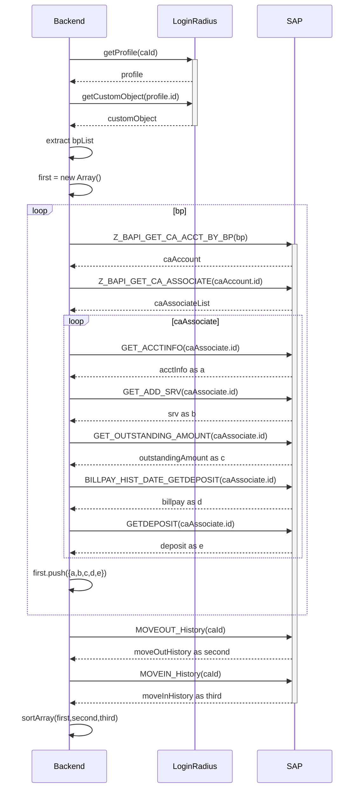

# Lottery system



In this system, a RESTful API server, we are selling tickets and perform the draws continuously and periodically.

After the previous draw, contestants can start to participate in the next draw.

Our system will generate a random number/string and assign it as 1 ticket per contestant.

Every ticket is unique and its identity should be generated by system.

Every `x` seconds there will be a draw and there will be only 1 winner.

And the system will response to contestants whether they win or not after the draw.

All tickets in 1 draw will be discarded once said draw is completed.

<br>

## Tech stack

This project provides a ticketing API built with Node.js, Express, and PostgreSQL.

It offers various endpoints for ticketing operations and incorporates SSE (Server-Sent Events) for real-time communication.

<br>

## Features

- Create, read, update, and delete tickets

- Secure PostgreSQL database connection

- Real-time drawing event updates with SSE

- API documentation with Swagger

- Newman for testing

<br>

## Installation

### Docker:

Install docker and docker-compose, the reference link:

https://docs.docker.com/engine/install/

```
git clone https://github.com/tindy-chu/lottery-system.git
```

<br>

## Start

### Run as local

```
make local
```

### or Run as production

```
make production
```

### Testing by newman

```
make test_api
```

### Endpoint

According to default environment variables:

Swagger UI:

```
http://localhost:8000
```

Adminer (GUI-based application to manage MySQL database):

```
http://localhost:8001
```

- Login:
  - System: PostgreSQL
  - Server: postgres
  - Username: root
  - password: pw
  - database: local

<br>

## Get command list

Run:

```
make help
```

<br>

## Environment Variables

All default environment variables' values are stored in the ./.env file,
and will be applied to the docker-compose.

- LOTTERY_API_PORT - API port

- LOTTERY_API_GAME_MILLISECOND - The games iteration time, the games will automatically start once kick-on the api

- LOTTERY_ADMINER_PORT - Adminer port

- LOTTERY_DB_USER - PostgreSQL database port

- LOTTERY_DB_PASSWORD - PostgreSQL database password

- LOTTERY_DB_NAME - PostgreSQL database name

<br>

## Limitations

- SSE (Server-Sent Events) Limited Browser Support: SSE is not supported in all web browsers. Notably, Internet Explorer and Microsoft Edge (prior to the Chromium version) do not support SSE.

  - To improve, apply polyfills like EventSource to simulate SSE support in browsers that do not support it natively.

- Database Scalability: The current implementation is designed for a single PostgreSQL database.

  - To improve, apply database sharding

- Error Handling: While the application does have some basic error handling in place, more robust error handling and logging mechanisms are needed for production use.

  - To improve, apply centralized error handling, a centralized error handling middleware that handles various types of errors.
